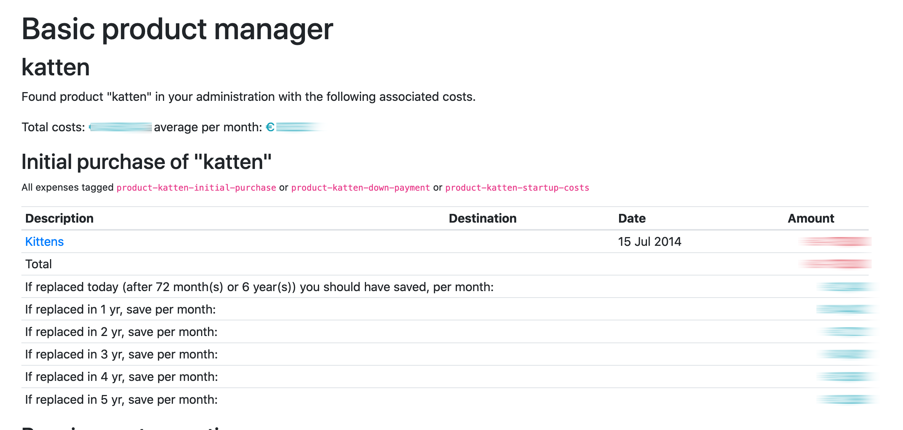

# Product manager

This is a fairly basic demonstration of what you can do with the [Firefly III](https://github.com/firefly-iii/firefly-iii/) **[API](https://api-docs.firefly-iii.org/)**.

## Introduction

This is a web-app, built on Laravel. It requires PHP 8.0. It can help you get an overview of the costs associated with a specific thing, such as your car, your pets or hobbies. It does this by collecting the tags associated with these things and group them according to the type of expense.

### Screenshots

## How it works

In your Firefly III installation, tag every product related expense with the `product-SUBJECT-TYPE` tag. For `SUBJECT`, you fill in the thing you wish to track. Use "car" for example. For `TYPE`, you fill in whatever the kind of cost is. Here are some examples:

* `product-car-initial-purchase`
* `product-car-repairs`
* `product-car-maintenance`
* `product-car-gas`

Or maybe:

* `product-washing-machine-initial-purchase`
* `product-washing-machine-soap`

The tool will give you an overview of each subject: for `initial-purchase`, `repairs` and the others the expenses will be listed. Also present is the amount spent per month.

### Initial purchase

Make sure you tag one withdrawal with `product-SUBJECT-initial-purchase`.

## Installation

Download or clone the source, run `composer install`. Copy `.env.example` to `.env` and fill in the APP_KEY (32 chars) and Firefly III API data. Visit your web browser. 

<!-- HELP TEXT -->

## Do you need help, or do you want to get in touch?

Do you want to contact me? You can email me at [james@firefly-iii.org](mailto:james@firefly-iii.org) or get in touch through one of the following support channels:

- [GitHub Discussions](https://github.com/firefly-iii/firefly-iii/discussions/) for questions and support
- [Gitter.im](https://gitter.im/firefly-iii/firefly-iii) for a good chat and a quick answer
- [GitHub Issues](https://github.com/firefly-iii/firefly-iii/issues) for bugs and issues
- <a rel="me" href="https://fosstodon.org/@ff3">Mastodon</a> for news and updates

<!-- END OF HELP TEXT -->

<!-- SPONSOR TEXT -->

## Support the development of Firefly III

If you like Firefly III and if it helps you save lots of money, why not send me a dime for every dollar saved! 🥳

OK that was a joke. If you feel Firefly III made your life better, please consider contributing as a sponsor. Please check out my [Patreon](https://www.patreon.com/jc5) and [GitHub Sponsors](https://github.com/sponsors/JC5) page for more information. You can also [buy me a ☕️ coffee at ko-fi.com](https://ko-fi.com/Q5Q5R4SH1). Thank you for your consideration.

<!-- END OF SPONSOR TEXT -->

## Questions and support.

This tool is built by [James Cole](james@firefly-iii.org). Contact me for questions.

Some disclaimers:

- Its not multi currency and will always display EUR.

License is AGPL-3-or higher.
